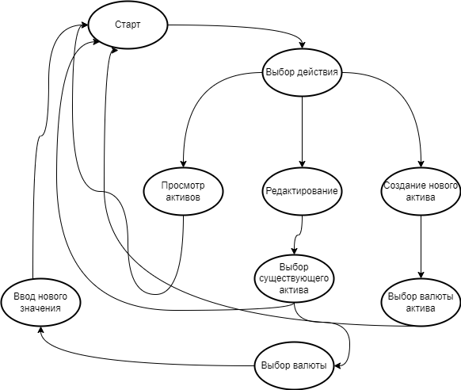

# Бот для подсчета накоплений.
Данный бот упрощает подсчет накоплений, позволяет выводить графически объем накопленных средств.

## Схема базы данных

## Состояния пользователя

docker run -i -e BOT_TOKEN=`cat .env` -e DB_PATH='/db_dir/work_db.db' -v db_dir:/db_dir/work_db money_accumulate_bot

## Сделать:
- [x] удаление накоплений
- [x] различные валюты у активов
- [x] вывод активов по валютам
- [x] проверка вводимых данных
- [ ] обработка неизвестных команд
- [ ] возможность отменить действие
- [ ] даты изменения накоплений